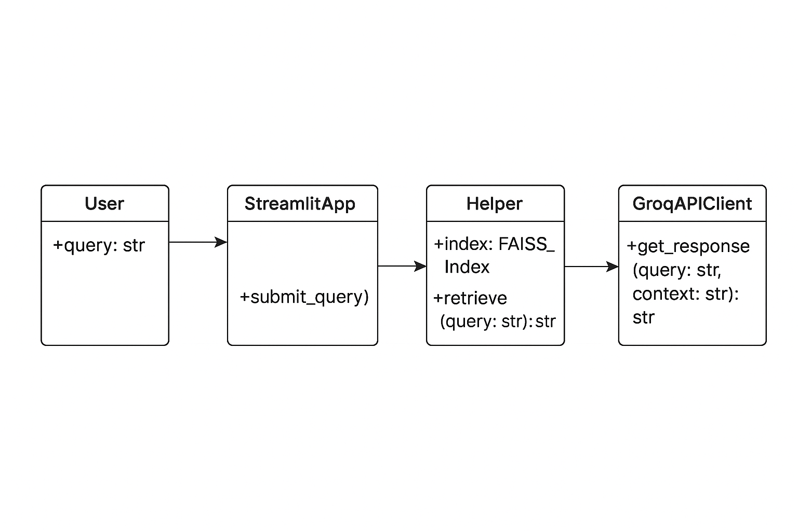
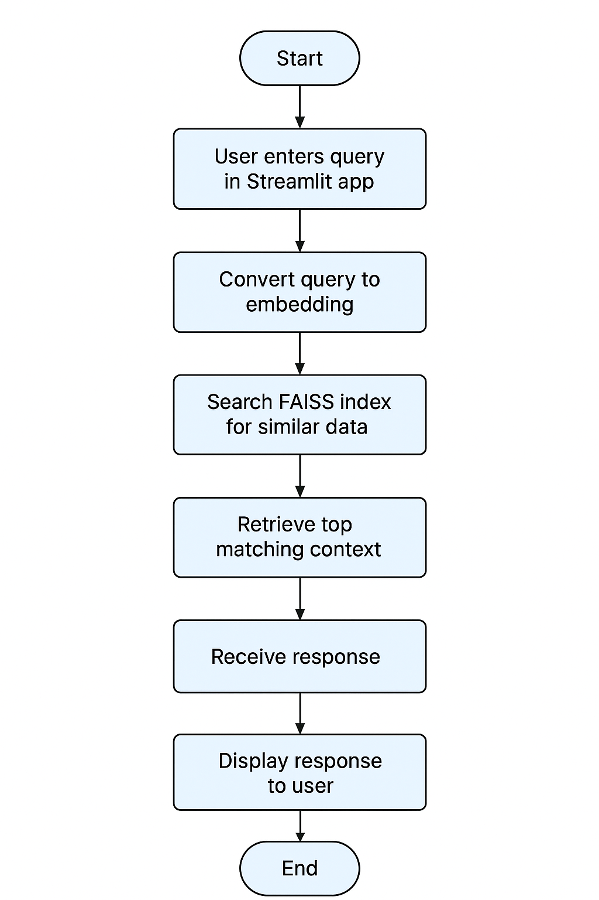
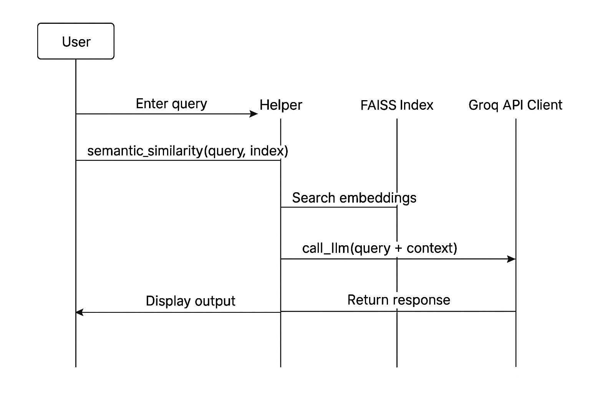

Customer Support Agent – System Design Documentation
1. Introduction

The Customer Support Agent project is an AI-powered application designed to process user queries, retrieve relevant information using a FAISS vector database, and generate accurate responses through an LLM (Groq API). This document details the architectural design using UML diagrams to facilitate understanding, development, and maintenance.

2. High-Level Architecture

The application consists of:

Streamlit App (app.py) – A web-based UI where users input queries.

Helper Module (src/helper.py) – Contains modular functions for semantic search and LLM calls.

FAISS Index (vector_store/) – Stores vector embeddings of the dataset for efficient retrieval.

Groq API – Processes context and generates intelligent responses.

3. UML Class Diagram

The diagram below models the logical components and their relationships:

Class Overview

User

Attributes:

query: str → Input query text.

Description: Represents the end user who interacts with the system.

StreamlitApp

Methods:

submit_query() → Accepts user query and triggers downstream processes.

Description: Provides the interface for input/output and calls helper functions.

Helper

Attributes:

index: FAISS_Index → The vector store for semantic search.

Methods:

retrieve(query: str): str → Finds context from FAISS index.

Description: Contains core functions for embedding and LLM integration.

GroqAPIClient

Methods:

get_response(query: str, context: str): str → Calls the LLM and returns an answer.

Description: Handles all communication with Groq API.

4. Activity Flow

User enters a query on the Streamlit app.

Query is embedded and compared with FAISS index (semantic similarity).

Top context is retrieved by the Helper module.

LLM is invoked using Groq API with the context.

Response is returned to Streamlit and displayed to the user.

5. Sequence of Interactions

User → StreamlitApp: Inputs query.

StreamlitApp → Helper: Calls semantic_similarity() and call_llm().

Helper → FAISS Index: Searches embeddings for relevant context.

Helper → Groq API Client: Sends query + context to LLM.

Groq API → Helper → StreamlitApp → User: Returns and displays the result.

6. Technology Stack

Frontend: Streamlit

Backend: Python 3.11

Vector Database: FAISS

Language Model API: Groq LLM

Environment Management: venv

Libraries: Pandas, FAISS, Requests, Streamlit

7. Future Improvements

Add authentication and role-based access control.

Support multilingual queries.

Implement caching of responses for frequently asked questions.

Enhance UI/UX with additional filters and analytics.