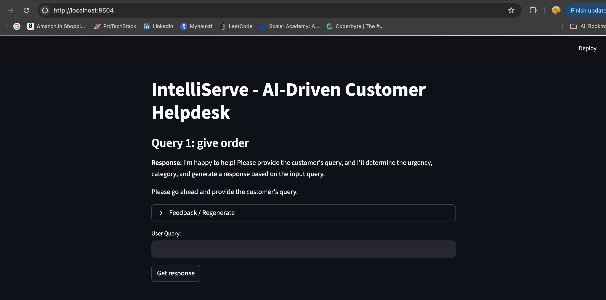

# Customer_Support_Agent

# Introduction
The objectives of the project are defined in Project Proposal pdf and requirements for the repository are in the txt file.

# Folder Structure
1. The folder `src/helper.py` contains all the modular functions needed in the project. 
2. `analysis.ipynb` notebook performs data analysis and EDA and also allows programmer to run the code. 
3. Setup the `groq key` as highlighted in the code and [here](https://console.groq.com/keys) in the enviroment variables. Put it on line 11 in `helper.py`.
3. `app.py` contains the streamlit demo code. To run it, go to the terminal and enter `streamlit run app.py` and follow the instructions.
4. The folder `vector_store` contains the FAISS database of the datset which is vectorized and stored and helps in the RAG pipeline process.

# Getting Started
1. After installing the packages, setup your Groq key in the enviroment. `helper.py` contains function `call_llm` which calls Groq API.
2. Embeddings are created and stored as FAISS index. To create embeddings, see the `analysis.ipynb`. Else, to get started quickly, just load the stored FAISS index.


## Prerequisites
Python 3.11.8 must be installed.
Ensure you have access to the required datasets and connection strings for databases.

### Virtual Environment Setup Instructions

#### For Mac and Linux:
Open a terminal and navigate to the project directory:

`cd /path/to/CUSTOMER_SUPPORT_AGENT`

Create a virtual environment using venv:


`python3 -m venv customer_support_env`


Activate the virtual environment:


`source customer_support_env/bin/activate`

Install the required dependencies from the requirements.txt file:


`pip install -r requirements.txt`

#### For Windows:
Open a command prompt and navigate to the project directory:

`cd \path\to\CUSTOMER_SUPPORT_AGENT`

Create a virtual environment using venv:

`python -m venv customer_support_env`


Activate the virtual environment:

`.\customer_support_env\Scripts\activate`

Install the required dependencies from the requirements.txt file:


`pip install -r requirements.txt`

#### Project Execution
Run the CUSTOMER_SUPPORT_AGENT application using Streamlit:
Add API Key in helper

`streamlit run app.py`

Access the application:

After running the command, the app will open automatically in your default browser.
If not, navigate to the provided local URL (usually http://localhost:8501/) to access the application.


```


├─ Customer_Support_Training_Dataset
│  └─ Customer_Support_Training_Dataset.csv
|  └─ dataset.md
├─ analysis.ipynb
├─ README.md
├─ app.py
├─ src
│  └─ helper.py
├─ vector_store
│  └─ faiss_index.index
├─ requirements.txt

```

# IntelliServe App
